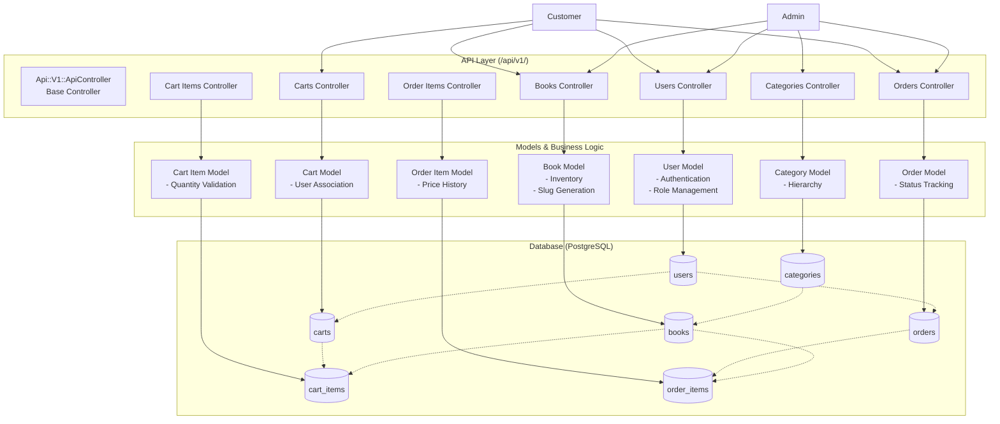
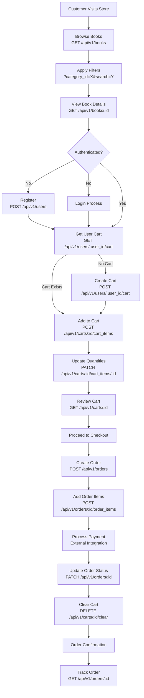
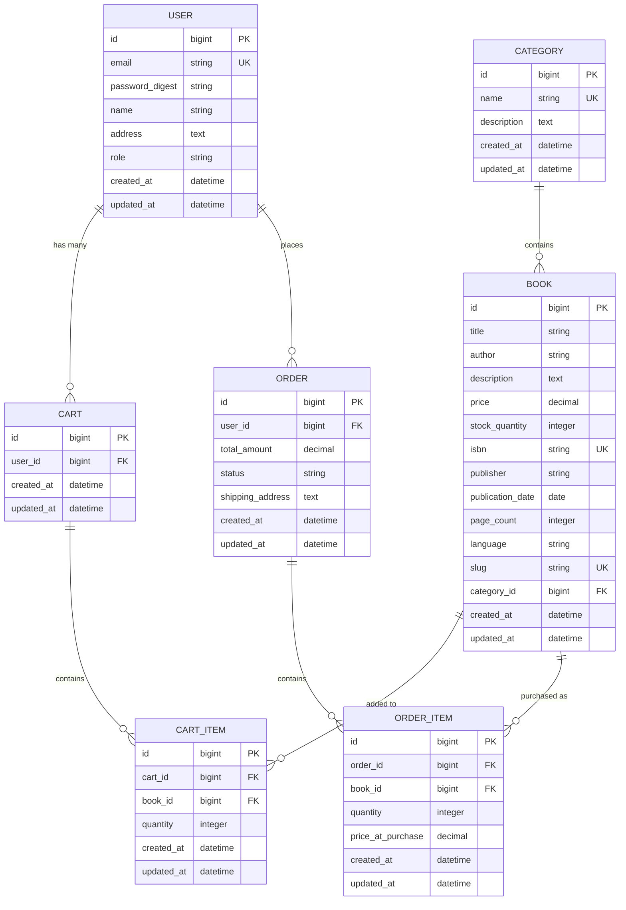
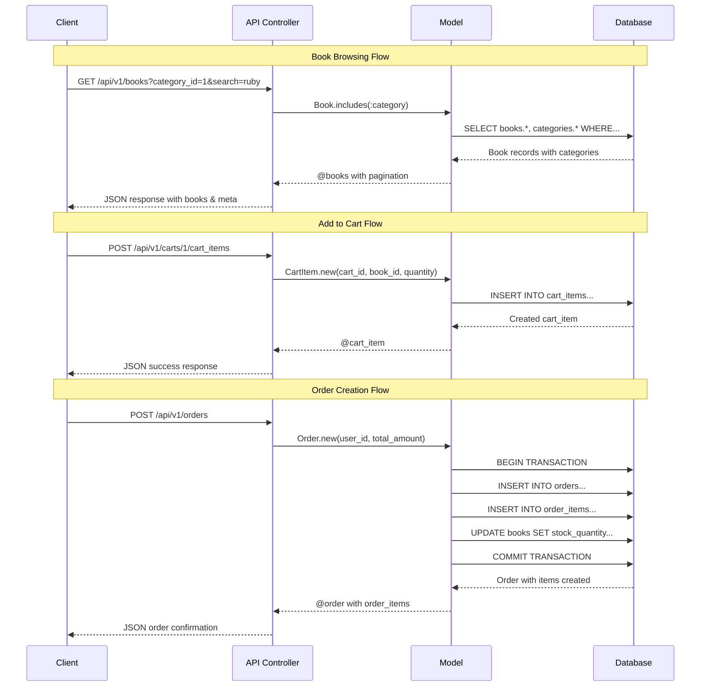
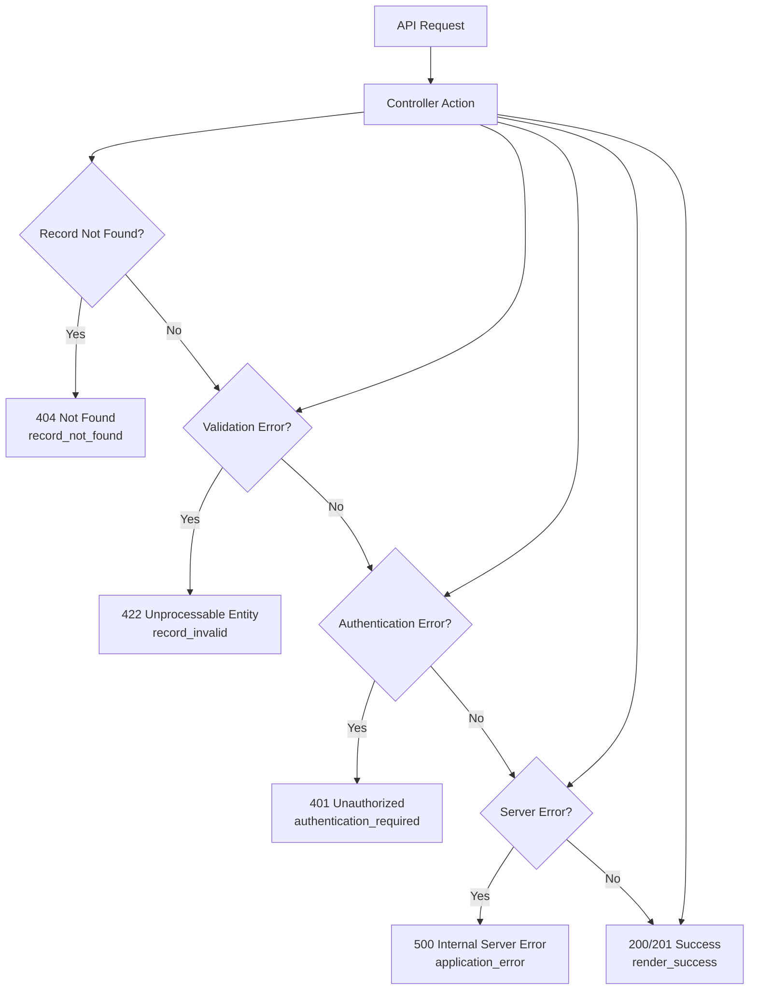

# Bookworm E-commerce System Flow Analysis

## Application Flow Diagram

## Customer Purchase Flow

## Admin Management Flow

```mermaid
graph TB
    AdminLogin[Admin Login]
    Dashboard[Admin Dashboard]
    
    %% Book Management
    BookMgmt[Book Management]
    ListBooks[List All Books<br/>GET /api/v1/books]
    CreateBook[Create New Book<br/>POST /api/v1/books]
    EditBook[Edit Book<br/>PATCH /api/v1/books/:id]
    DeleteBook[Delete Book<br/>DELETE /api/v1/books/:id]
    
    %% Category Management
    CatMgmt[Category Management]
    ListCats[List Categories<br/>GET /api/v1/categories]
    CreateCat[Create Category<br/>POST /api/v1/categories]
    EditCat[Edit Category<br/>PATCH /api/v1/categories/:id]
    
    %% Order Management
    OrderMgmt[Order Management]
    ListOrders[List All Orders<br/>GET /api/v1/orders]
    ViewOrder[View Order Details<br/>GET /api/v1/orders/:id]
    UpdateOrderStatus[Update Status<br/>PATCH /api/v1/orders/:id]
    
    %% User Management
    UserMgmt[User Management]
    ListUsers[List Users<br/>GET /api/v1/users]
    ViewUser[View User<br/>GET /api/v1/users/:id]
    UpdateUser[Update User<br/>PATCH /api/v1/users/:id]
    
    %% Flow
    AdminLogin --> Dashboard
    Dashboard --> BookMgmt
    Dashboard --> CatMgmt
    Dashboard --> OrderMgmt
    Dashboard --> UserMgmt
    
    BookMgmt --> ListBooks
    BookMgmt --> CreateBook
    BookMgmt --> EditBook
    BookMgmt --> DeleteBook
    
    CatMgmt --> ListCats
    CatMgmt --> CreateCat
    CatMgmt --> EditCat
    
    OrderMgmt --> ListOrders
    OrderMgmt --> ViewOrder
    OrderMgmt --> UpdateOrderStatus
    
    UserMgmt --> ListUsers
    UserMgmt --> ViewUser
    UserMgmt --> UpdateUser
```

## Data Relationship Flow

## Request/Response Flow

## Error Handling Flow

## Key Features Summary

### 1. **RESTful API Design**
- Consistent JSON responses via `render_success` and `render_error`
- Proper HTTP status codes
- Nested resources (orders/order_items, carts/cart_items)

### 2. **Data Integrity**
- Foreign key constraints
- Unique indexes on critical fields (email, ISBN, slug)
- Model validations for business rules

### 3. **Search & Filtering**
- Category-based filtering
- Text search on book titles
- Price range filtering
- Pagination support

### 4. **Shopping Cart Features**
- User-specific carts
- Quantity management
- Cart clearing functionality
- Cart persistence across sessions

### 5. **Order Management**
- Order status tracking (pending → processing → shipped → delivered)
- Price history preservation
- Order item management

### 6. **Security Features**
- Password encryption via `has_secure_password`
- Role-based access (admin/customer)
- CSRF protection disabled for API
- Parameter filtering for sensitive data

### 7. **Business Logic**
- Automatic slug generation for books
- Stock quantity management
- Total amount calculations
- User role validation

This system provides a solid foundation for an e-commerce book store with room for future enhancements like payment processing, advanced search, recommendations, and inventory alerts.